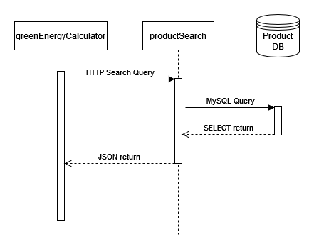

# productSearch Microservice 

The _productSearch_ Microservice is a database of green energy products with a
single-point interface. It functions as a search service for Curtis's
_greenEnergyCalculator_ application, from which the user may query a MySQL database
of energy products via HTTP and in turn receive a list of JSON 
objects matching the search parameters.

## Communication Contract

To call the API, simply send an HTTP request to
```commandline
http://flip1.engr.oregonstate.edu:6363/productsearch?<param>=<arg>
```

A search query may include any or all of the following parameter argument pairs:
```commandline
greenEnergyType     =   '[string]'
productID           =   [int]
cost                =   [comparison_operator][float]
power               =   [comparison_operator][float] 
```

Encode comparison operators as follows:
```commandline
'='     as 'eq'
'>'     as 'gt'
'<'     as 'lt'
'>='    as 'geq'
'<='    as 'leq'
```

Multiple arguments may be passed by separating each with `&`.

To search the database for solar energy products costing
less than $400, one would request the following URL...
```commandline
http://flip1.engr.oregonstate.edu:6363/productsearch?greenEnergyType='solar'&cost=leq400
```
... and in return, receive a list of JSONs for each matching product.

### Example Call

A super basic Python script using the fantastic 
[Requests](https://docs.python-requests.org/en/latest/) module...
```python
import requests

results = requests.get(
    "http://flip1.engr.oregonstate.edu:6363/productsearch?greenEnergyType='solar'&cost=leq400"
)
print(results.text)
```
...will print the following result:
```python
[
    {
        "cost": "340.00", 
        "description": "Nominal power: 400 Watts, Number of cells: 132 half-cut, Power tolerance: 0 / +5 Watts, Vmp: 37.6 Volts, Voc: 45.0 Volts, Imp: 10.64 Amps, Isc: 11.39 Amps, Module efficiency: 20.3%, Dimensions (inches): 74.8 x 40.9 x 1.2, Weight: 48.0 lbs", 
        "genericName": "REC Solar N-PEAK 3 Black Series 400 Watt Monocrystalline Solar Module", 
        "greenEnergyType": "solar", 
        "power": "400", 
        "productID": 1
    }
]
```


## UML Sequence Diagram
